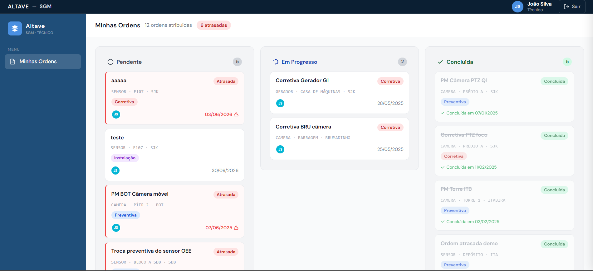
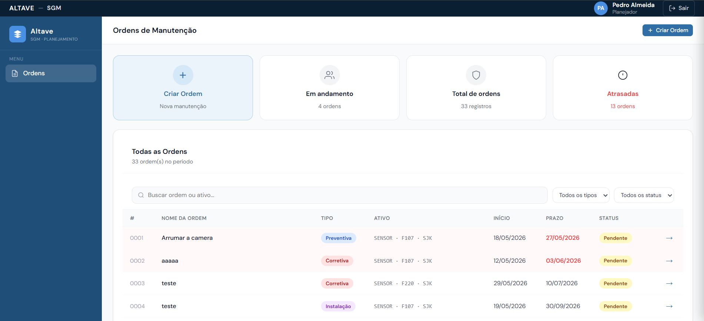
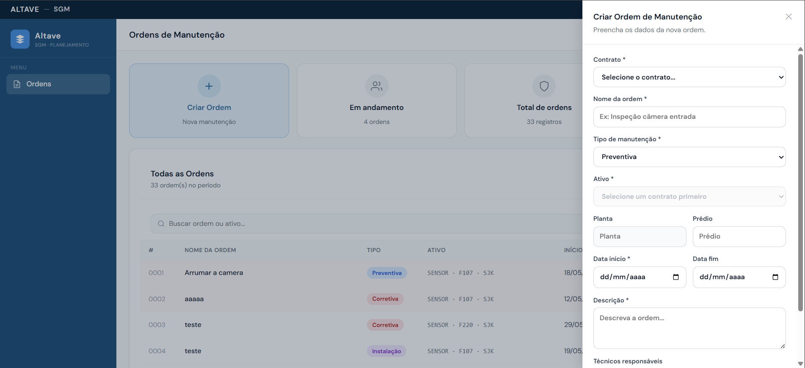

# Sprint 1 – Módulo de Gestão de Ordens de Manutenção

## Objetivo
Desenvolver as funcionalidades principais do sistema para permitir o gerenciamento de Ordens de Manutenção (OMs), contemplando os perfis de Planejador e Técnico.

---

## User Stories – Técnico

| Rank | Prioridade | User Story | SP | Sprint |
|------|-----------|------------|----|--------|
| 1 | 🔴 Alta | **Como** Técnico **Quero** visualizar todas as ordens atribuídas a mim **Para que** eu possa acompanhar minhas atividades e prioridades. | 13 | 1 |

### Critérios de Aceitação
- Exibir apenas as ordens atribuídas ao técnico logado.
- Exibir quantidade total de ordens e quantidade de ordens atrasadas.
- Exibir em cada ordem:
    - Nome da Ordem
    - Tipo de manutenção
    - Planta
    - Prédio
    - Ativo
    - Unidade/Empresa
    - Data de início
    - Data de prazo
    - Técnico responsável
- Destacar visualmente ordens atrasadas.
- Disponibilizar quadro Kanban com os status:
    - Pendente
    - Em Andamento
    - Concluída
- Exibir a quantidade de ordens em cada coluna.
- Atualizar automaticamente a posição das ordens conforme a mudança de status.
- Permitir iniciar, pausar e concluir ordens de manutenção.
- Manter histórico das pausas realizadas.
- Permitir iniciar apenas ordens pendentes.
- Permitir pausar e concluir apenas ordens em andamento.
- Atualizar automaticamente os indicadores e o quadro Kanban após alterações de status.

### Tarefas Técnicas
Desenvolver a tela Minhas Ordens.
Implementar consulta de ordens por técnico.
Desenvolver os cards de exibição das ordens.
Implementar indicador visual de atraso.
Desenvolver o componente Kanban.
Implementar agrupamento e atualização dinâmica das ordens por status.
Desenvolver as funcionalidades de iniciar, pausar e concluir ordens.
Implementar persistência e atualização dos status no banco de dados.
Registrar eventos de início, pausa e conclusão.
Atualizar automaticamente o Kanban após alterações nas ordens.

### Wireframe

---

## User Stories – Planejador

| Rank | Prioridade | User Story | SP | Sprint |
|------|-----------|------------|----|--------|
| 2 | 🔴 Alta | **Como** Planejador **quero** visualizar indicadores das ordens de manutenção **para que** eu possa acompanhar o desempenho operacional. | 8 | 1 |
| 3 | 🔴 Alta | **Como** Planejador **quero** cadastrar uma nova ordem de manutenção **para que** ela seja atribuída a um técnico responsável. | 8 | 1 |
| 4 | 🔴 Alta | **Como** Planejador **quero** visualizar todas as ordens cadastradas **para que** eu possa acompanhar e gerenciar as manutenções.| 13 | 1 |

### Critérios de Aceitação
- Exibir dashboard contendo os KPIs:
  - Ordens em andamento
  - Total de ordens
  - Ordens atrasadas
- Atualizar os indicadores automaticamente conforme as alterações das ordens.
- Permitir o cadastro de novas ordens de manutenção.
- Permitir informar:
  - Nome da ordem
  - Tipo da manutenção
  - Planta
  - Prédio
  - Ativo
  - Empresa/Unidade
  - Data de início
  - Prazo
  - Técnico responsável
- Salvar novas ordens com status inicial "Pendente".
- Exibir todas as ordens em uma tabela de consulta.
- Exibir na tabela:
  - Número da ordem
  - Nome da ordem
  - Tipo
  - Ativo
  - Data de início
  - Prazo
  - Status
- Permitir busca por nome da ordem ou ativo.
- Permitir filtragem por tipo e status.
- Destacar visualmente as ordens atrasadas.
- Atualizar a listagem automaticamente após a criação ou alteração de uma ordem.

### Tarefas Técnicas
- Desenvolver dashboard de acompanhamento das ordens.
- Implementar consultas agregadas para cálculo dos KPIs.
- Desenvolver componentes de indicadores.
- Desenvolver formulário de cadastro de ordens.
- Implementar validações dos campos obrigatórios.
- Persistir informações das ordens no banco de dados.
- Desenvolver tabela de listagem de ordens.
- Implementar busca e filtros.
- Implementar paginação da tabela.
- Implementar destaque visual para ordens atrasadas.
- Atualizar dashboard e listagem dinamicamente após alterações.

### Wireframe

 

---

## Entregáveis da Sprint

### Perfil Técnico
- Página "Minhas Ordens".
- Kanban de ordens.
- Iniciar ordem.
- Pausar ordem.
- Concluir ordem.
- Indicador de ordens atrasadas.

### Perfil Planejador
- Dashboard com KPIs.
- Cadastro de ordens.
- Listagem de ordens.
- Busca e filtros.
- Visualização de status das ordens.

### Resultado Esperado
Ao final da Sprint 1, o Planejador será capaz de criar e acompanhar ordens de manutenção, enquanto o Técnico poderá gerenciar a execução das atividades através de um quadro Kanban com controle completo do ciclo de vida das ordens.