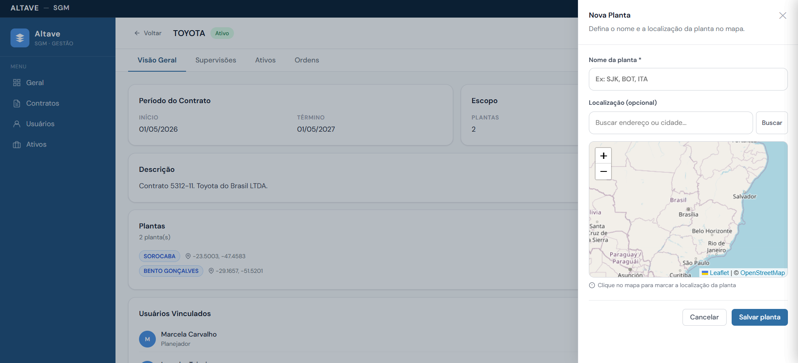
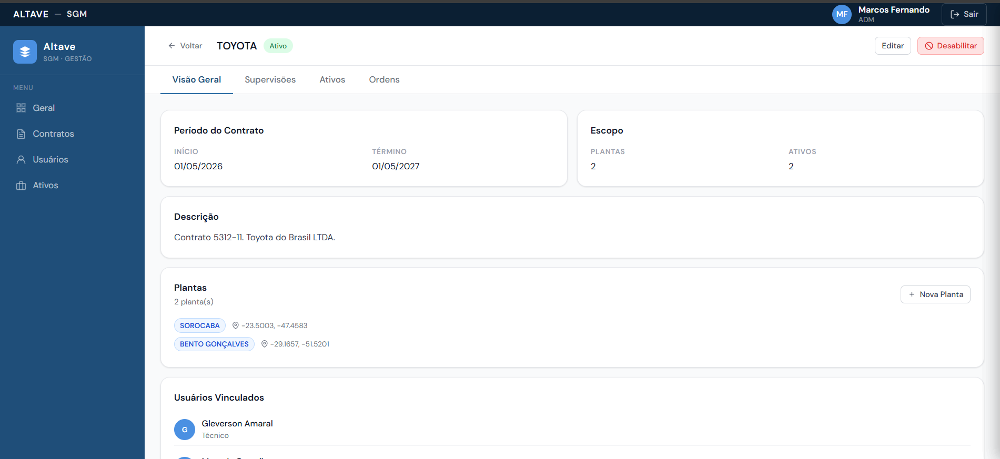
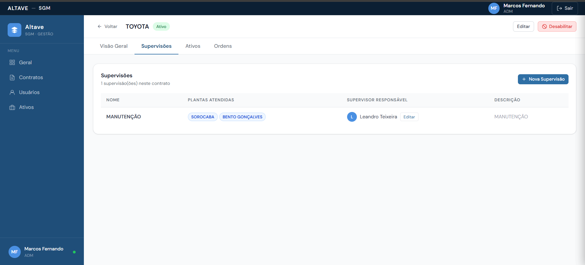
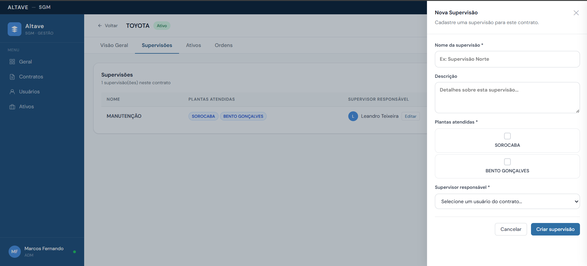
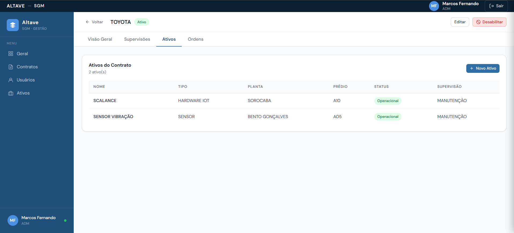
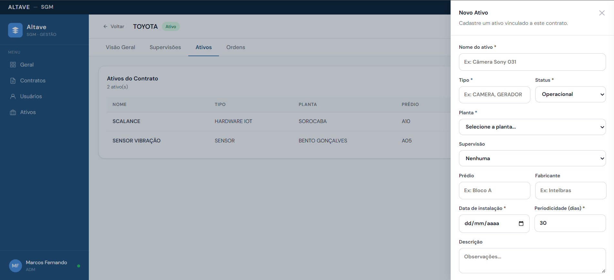
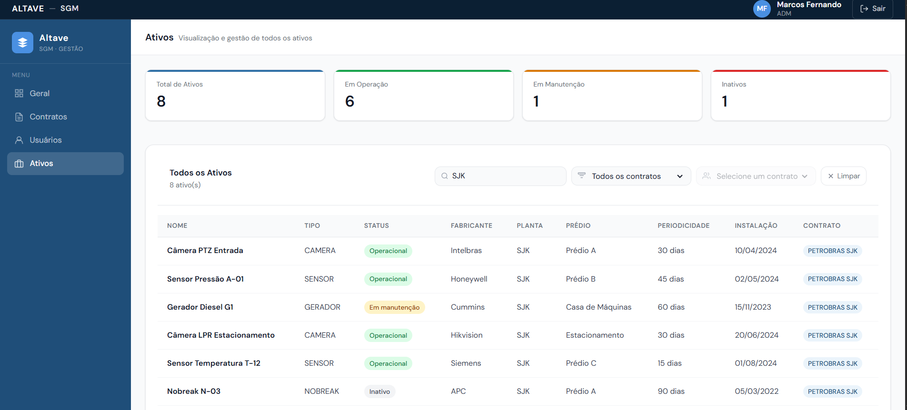

# Sprint 2 – Gerenciamento de Contratos - Tela ADM

| Rank | Prioridade | User Story | SP | Sprint |
|------|-----------|------------|----|--------|
| 5 | 🟡 Média | **Como** Administrador **quero** cadastrar, visualizar e acompanhar os contratos dos clientes **para que** eu possa gerenciar as empresas atendidas e monitorar os recursos vinculados a cada contrato | 5 | 2 |.

### Critérios de Aceitação
- Exibir dashboard contendo os KPIs:
  - Total de contratos
  - Total de ativos
  - Total de usuários
  - Ordens em andamento
- Atualizar os indicadores automaticamente conforme alterações no sistema.
- Permitir o cadastro de novos contratos.
- Permitir informar:
  - Nome da empresa
  - Data de início
  - Data de término
  - Plantas vinculadas ao contrato
  - Descrição do contrato
- Exigir o preenchimento dos campos obrigatórios.
- Permitir adicionar uma ou mais plantas ao contrato.
- Salvar o contrato com status correspondente à sua vigência.
- Exibir todos os contratos cadastrados em uma tabela.
- Exibir na tabela:
  - Empresa
  - Data de início
  - Data de término
  - Quantidade de plantas
  - Quantidade de ativos
  - Status do contrato
- Permitir visualizar os detalhes de um contrato.
- Permitir editar contratos existentes.
- Permitir excluir contratos.
- Destacar visualmente contratos ativos e inativos.
- Atualizar a listagem automaticamente após operações de cadastro, edição ou exclusão.

### Tarefas Técnicas
- Desenvolver dashboard com indicadores gerenciais.
- Implementar consultas agregadas para cálculo dos KPIs.
- Desenvolver componentes de KPI.
- Desenvolver formulário de cadastro de contratos.
- Implementar validações dos campos obrigatórios.
- Implementar gerenciamento de plantas vinculadas ao contrato.
- Persistir informações dos contratos no banco de dados.
- Desenvolver tabela de listagem de contratos.
- Implementar funcionalidades de visualização, edição e exclusão.
- Implementar cálculo automático do status do contrato.
- Implementar atualização dinâmica dos KPIs e da listagem.
- Implementar tratamento de erros e mensagens de sucesso.

### Wireframe

## User Stories - Gerenciamento de Usuários
| Rank | Prioridade | User Story | SP | Sprint |
|------|-----------|------------|----|--------|
| 6 | 🟡 Média | **Como** Administrador **quero** cadastrar e visualizar usuários do sistema **para que** eu possa controlar os acessos e responsabilidades de cada colaborador. | 8 | 2 |

### Critérios de Aceitação
- Permitir o cadastro de novos usuários.
- Permitir informar:
  - Nome completo
  - E-mail
  - Senha
  - Cargo
  - Status (Ativo/Inativo)
  - Função
  - Data de nascimento
- Validar campos obrigatórios.
- Validar formato de e-mail.
- Permitir definir o status inicial do usuário.
- Salvar as informações do usuário no sistema.
- Exibir todos os usuários cadastrados em uma tabela.
- Exibir na tabela:
  - Usuário
  - E-mail
  - Cargo
  - Função
- Atualizar a listagem automaticamente após o cadastro de um novo usuário.

### Tarefas Técnicas
- Desenvolver formulário de cadastro de usuários.
- Implementar validações dos campos obrigatórios.
- Implementar validação de e-mail.
- Implementar cadastro e persistência dos usuários no banco de dados.
- Implementar armazenamento seguro da senha.
- Desenvolver tabela de listagem de usuários.
- Implementar consulta dos usuários cadastrados.
- Implementar atualização dinâmica da listagem após novos cadastros.
- Implementar tratamento de erros e mensagens de sucesso.

### Wireframes
 

## User Stories - Visão Geral e Gestão do Contrato

| Rank | Prioridade | User Story | SP | Sprint |
|------|-----------|------------|----|--------|
| 7 | 🟡 Média | **Como** Administrador **quero** visualizar os detalhes de um contrato e gerenciar suas plantas e colaboradores vinculados **para que** eu possa administrar a estrutura operacional de cada cliente. | 8 | 3 |

### Critérios de Aceitação
- Exibir as informações cadastradas do contrato:
  - Nome da empresa
  - Status do contrato
  - Data de início
  - Data de término
  - Descrição
- Exibir indicadores do escopo do contrato:
  - Quantidade de plantas
  - Quantidade de ativos
- Exibir a lista de plantas vinculadas ao contrato.
- Exibir a lista de usuários vinculados ao contrato.
- Permitir vincular colaboradores ao contrato.
- Permitir visualizar o cargo/função dos colaboradores vinculados.
- Permitir adicionar novas plantas ao contrato.
- Permitir informar:
  - Nome da planta
  - Localização da planta
- Permitir selecionar a localização da planta através de um mapa GIS.
- Armazenar as coordenadas geográficas da planta.
- Exibir a localização cadastrada da planta.
- Atualizar automaticamente os indicadores e listagens após alterações.
- Permitir editar as informações do contrato.
- Permitir desabilitar contratos.

### Tarefas Técnicas
- Desenvolver tela de detalhes do contrato.
- Implementar consulta detalhada dos dados do contrato.
- Desenvolver seção de informações gerais do contrato.
- Desenvolver seção de plantas vinculadas.
- Desenvolver seção de colaboradores vinculados.
- Implementar vinculação de usuários ao contrato.
- Desenvolver modal de cadastro de plantas.
- Integrar sistema de mapas (GIS).
- Implementar captura e armazenamento das coordenadas geográficas.
- Persistir plantas vinculadas ao contrato.
- Implementar atualização dinâmica dos indicadores do contrato.
- Implementar edição e desativação de contratos.
- Implementar validações e tratamento de erros.

### Wireframes 
 

## User Stories – Gerenciamento de supervisões

| Rank | Prioridade | User Story | SP | Sprint |
|------|-----------|------------|----|--------|
| 8 | 🟡 Média | **Como** Administrador **quero** criar e gerenciar supervisões vinculadas aos contratos **para que** eu possa organizar a gestão das plantas e definir responsáveis pelo acompanhamento das operações. | 8 | 2 |

### Critérios de Aceitação
- Permitir o cadastro de supervisões vinculadas a um contrato.
- Permitir informar:
  - Nome da supervisão
  - Descrição
  - Plantas atendidas
  - Supervisor responsável
- Permitir selecionar uma ou mais plantas vinculadas ao contrato.
- Permitir selecionar como supervisor responsável apenas usuários vinculados ao contrato.
- Exibir todas as supervisões cadastradas em uma tabela.
- Exibir na listagem:
  - Nome da supervisão
  - Plantas atendidas
  - Supervisor responsável
  - Descrição
- Permitir alterar o supervisor responsável de uma supervisão existente.
- Atualizar automaticamente as informações após alterações.
- Garantir que uma supervisão permaneça associada ao contrato de origem.

### Tarefas Técnicas
- Desenvolver tela de listagem de supervisões.
- Desenvolver formulário de cadastro de supervisões.
- Implementar seleção de plantas vinculadas ao contrato.
- Implementar seleção de supervisor responsável.
- Implementar validações dos campos obrigatórios.
- Persistir supervisões no banco de dados.
- Desenvolver funcionalidade de edição da supervisão.
- Implementar alteração do supervisor responsável.
- Desenvolver consulta das supervisões por contrato.
- Atualizar a listagem dinamicamente após cadastro ou edição.
- Implementar tratamento de erros e mensagens de sucesso.

### Wireframe

 

## User Stories – Gerenciamento de Ativos

| Rank | Prioridade | User Story | SP | Sprint |
|------|-----------|------------|----|--------|
| 9 | 🟡 Média | **Como** Administrador **quero** cadastrar e visualizar os ativos vinculados a um contrato **para que** eu possa gerenciar os equipamentos monitorados e mantidos pelo sistema. | 8 | 2 |

### Critérios de Aceitação
- Permitir o cadastro de ativos vinculados a um contrato.
- Permitir informar:
  - Nome do ativo
  - Tipo
  - Status
  - Planta
  - Supervisão
  - Prédio
  - Fabricante
  - Data de instalação
  - Periodicidade (dias)
  - Descrição
- Permitir selecionar apenas plantas pertencentes ao contrato.
- Permitir vincular o ativo a uma supervisão cadastrada.
- Salvar o ativo associado ao contrato correspondente.
- Exibir todos os ativos vinculados ao contrato em uma tabela.
- Exibir na listagem:
  - Nome do ativo
  - Tipo
  - Planta
  - Prédio
- Atualizar a listagem automaticamente após o cadastro de um novo ativo.
- Permitir visualizar as informações do ativo cadastrado.

### Tarefas Técnicas
- Desenvolver tela de listagem de ativos do contrato.
- Desenvolver formulário de cadastro de ativos.
- Implementar validações dos campos obrigatórios.
- Implementar seleção de plantas vinculadas ao contrato.
- Implementar seleção de supervisões cadastradas.
- Persistir informações dos ativos no banco de dados.
- Desenvolver consulta dos ativos por contrato.
- Implementar atualização dinâmica da listagem.
- Implementar tratamento de erros e mensagens de sucesso.

### Wireframe
 

## User Stories – Visualização dos ativos 

| Rank | Prioridade | User Story | SP | Sprint |
|------|-----------|------------|----|--------|
| 9 | 🟡 Média | **Como** Administrador **quero** cadastrar e visualizar os ativos vinculados a um contrato **para que** eu possa gerenciar os equipamentos monitorados e mantidos pelo sistema. | 8 | 2 |

### Critérios de Aceitação

- Permitir a visualização nos KPIS:
  - Total de ativos
  - Em operação (Ativos funcionando)
  - Em manutenção (Ativos em manutenção)
  - Inativos (Ativos não em uso)
- Permitir a visualização de todos os ativos em tabela, apresentando informações:
  - Nome
  - Tipo
  - Status
  - Fabricante
  - Planta
  - Prédio
  - Periodicidade
  - Instalação
  - Contrato
- Permitir o filtro por contrato
- Permitir a busca dos ativos

### Tarefas Técnicas
- Desenvolver tela de listagem de todos os ativos
- Desenvolver KPIS para apresentar o total de ativos, em operação, em manutenção e inativos
- Desenvolver a tabela para listar os ativos de todos os contratos
- Desenvolver o sistema de busca dos ativos
- Desenvolver o sistema de filtro por contrato

### Wireframe

