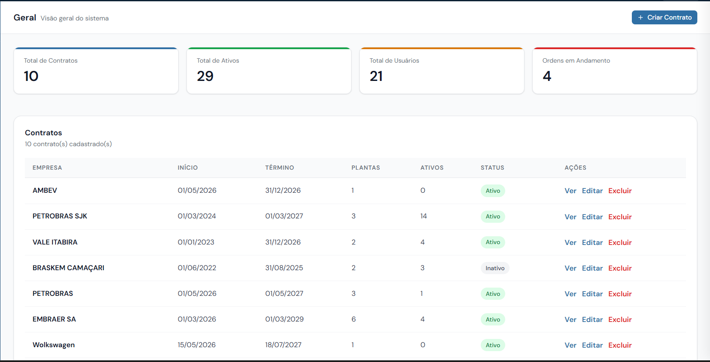
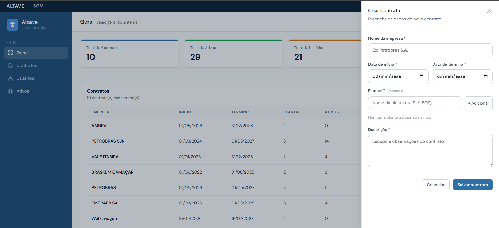
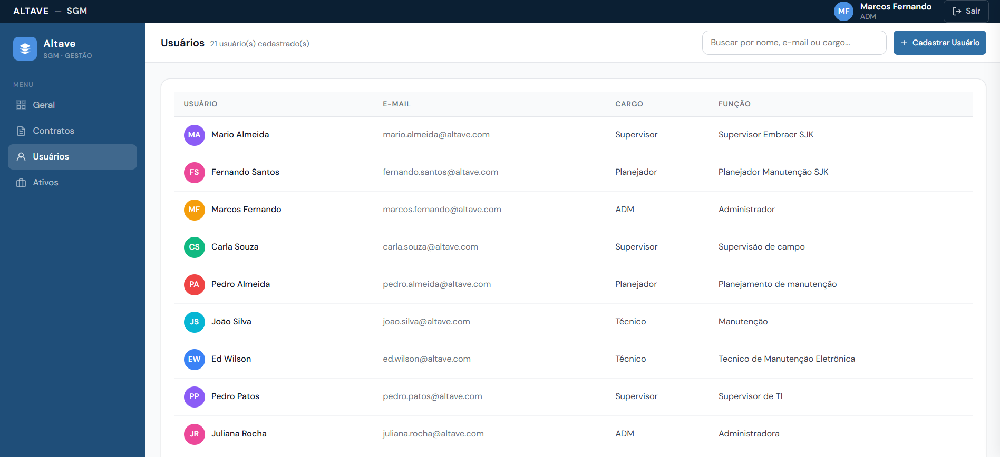
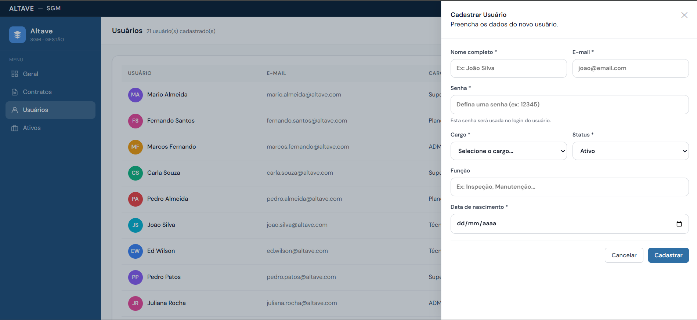

# Sprint 2 – Gerenciamento de Contratos

| Rank | Prioridade | User Story | SP | Sprint |
|------|-----------|------------|----|--------|
| 5 | 🟡 Média | **Como** Administrador **quero** cadastrar, visualizar e acompanhar os contratos dos clientes **para que** eu possa gerenciar as empresas atendidas e monitorar os recursos vinculados a cada contrato | 5 | 2 |.

### Critérios de Aceitação
- Exibir dashboard contendo os KPIs:
  - Total de contratos
  - Total de ativos
  - Total de usuários
  - Ordens em andamento
- Atualizar os indicadores automaticamente conforme alterações no sistema.
- Permitir o cadastro de novos contratos.
- Permitir informar:
  - Nome da empresa
  - Data de início
  - Data de término
  - Plantas vinculadas ao contrato
  - Descrição do contrato
- Exigir o preenchimento dos campos obrigatórios.
- Permitir adicionar uma ou mais plantas ao contrato.
- Salvar o contrato com status correspondente à sua vigência.
- Exibir todos os contratos cadastrados em uma tabela.
- Exibir na tabela:
  - Empresa
  - Data de início
  - Data de término
  - Quantidade de plantas
  - Quantidade de ativos
  - Status do contrato
- Permitir visualizar os detalhes de um contrato.
- Permitir editar contratos existentes.
- Permitir excluir contratos.
- Destacar visualmente contratos ativos e inativos.
- Atualizar a listagem automaticamente após operações de cadastro, edição ou exclusão.

### Tarefas Técnicas
- Desenvolver dashboard com indicadores gerenciais.
- Implementar consultas agregadas para cálculo dos KPIs.
- Desenvolver componentes de KPI.
- Desenvolver formulário de cadastro de contratos.
- Implementar validações dos campos obrigatórios.
- Implementar gerenciamento de plantas vinculadas ao contrato.
- Persistir informações dos contratos no banco de dados.
- Desenvolver tabela de listagem de contratos.
- Implementar funcionalidades de visualização, edição e exclusão.
- Implementar cálculo automático do status do contrato.
- Implementar atualização dinâmica dos KPIs e da listagem.
- Implementar tratamento de erros e mensagens de sucesso.

### Wireframe

## User Stories - Gerenciamento de Usuários
| Rank | Prioridade | User Story | SP | Sprint |
|------|-----------|------------|----|--------|
| 6 | 🟡 Média | **Como** Administrador **quero** cadastrar e visualizar usuários do sistema **para que** eu possa controlar os acessos e responsabilidades de cada colaborador. | 8 | 2 |

### Critérios de Aceitação
- Permitir o cadastro de novos usuários.
- Permitir informar:
  - Nome completo
  - E-mail
  - Senha
  - Cargo
  - Status (Ativo/Inativo)
  - Função
  - Data de nascimento
- Validar campos obrigatórios.
- Validar formato de e-mail.
- Permitir definir o status inicial do usuário.
- Salvar as informações do usuário no sistema.
- Exibir todos os usuários cadastrados em uma tabela.
- Exibir na tabela:
  - Usuário
  - E-mail
  - Cargo
  - Função
- Atualizar a listagem automaticamente após o cadastro de um novo usuário.

### Tarefas Técnicas
- Desenvolver formulário de cadastro de usuários.
- Implementar validações dos campos obrigatórios.
- Implementar validação de e-mail.
- Implementar cadastro e persistência dos usuários no banco de dados.
- Implementar armazenamento seguro da senha.
- Desenvolver tabela de listagem de usuários.
- Implementar consulta dos usuários cadastrados.
- Implementar atualização dinâmica da listagem após novos cadastros.
- Implementar tratamento de erros e mensagens de sucesso.

### Wireframes
 