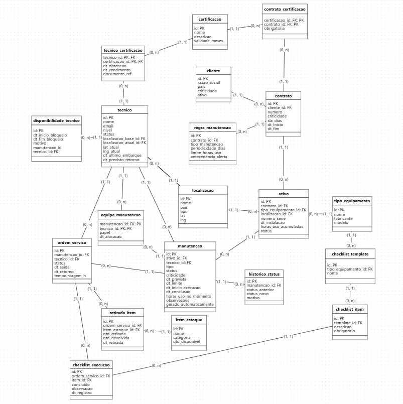

# 📚 Dicionário de Dados 

## 📌 Visão Geral
Sistema de gestão de ativos, contratos, manutenções e técnicos, incluindo logística, planejamento e controle de checklists.

## Diagrama Entidade-Relacionamento (DER)

## 🧱 Módulo 1 - Ativos e Contratos

### 🤵‍♂️ Tabela Cliente

Armazena informações dos clientes da Altave

| Campo | Tipo | Obrigatório | Descrição | Observação |
|-------|------|-------------|-----------|------------|
| id    | NUMBER |  Sim      | Identificador do cliente | PK |
| razao_social | VARCHAR2(200) | Sim | Nome da empresa | |
| pais | VARCHAR2(200) | Sim | País do cliente | | 
| criticidade | VARCHAR2(200) | Sim | Nível de criticidade | CHECK |
| ativo | CHAR(1) | Sim | Cliente ativo (S/N) | DEFAULT S | 

### 📄 Tabela Contrato

Representa os contratos firmados com o cliente

| Campo | Tipo | Obrigatório | Descrição | Observação |
|-------|------|-------------|-----------|------------|
| id    | NUMBER | Sim | Identificador do contrato | PK |
| cliente_id | NUMBER | Sim | Cliente vinculado | FK -> cliente.id |
| numero | VARCHAR2(50) | Sim | Número do contrato | UNIQUE | 
| criticidade | VARCHAR2(10) | Sim | Nível de criticidade | CHECK |
| sla_dias | NUMBER | Sim | SLA em dias | | 
| dt_inicio | DATE | Sim | Data de início do contrato | |
| dt_fim | DATE | Sim | Data de fim do contrato | |

### ⭐ Tabela certificacao

Representa as certificações que a empresa exige e também as certificações que o técnico possue.

| Campo | Tipo | Obrigatório | Descrição | Observação |
|-------|------|-------------|-----------|------------|
| id | NUMBER | Sim | Identificador da certificação | PK |
| nome | VARCHAR2(50) | Sim | Nome da certificação | | 
| descricao | VARCHAR2(500) | Não | Descrição da certificação | |  
| validade_meses | NUMBER | Sim | Validade da certificação | |

### 🔗 Tabela contrato_certificacao

| Campo | Tipo | Obrigatório | Descrição | Observação |
|-------|------|-------------|-----------|------------|
| contrato_id |	NUMBER | Sim |	Contrato |	PK/FK     |
| certificacao_id |	NUMBER | Sim |	Certificação |	PK/FK | 
| obrigatoria |	CHAR(1) | Sim	| Se é obrigatória (S/N) |	DEFAULT S |

### 📍 Tabela localização

Representa a localização dos ativos e dos técnicos.

| Campo | Tipo | Obrigatório | Descrição | Observação |
|-------|------|-------------|-----------|------------|
| id	| NUMBER | Sim | Identificador da localização | PK | 
| nome	| VARCHAR2(200) | Sim |	Nome do local |	|
| pais	| VARCHAR2(100) | Sim | País | |	
| tipo	| VARCHAR2(20) | Sim | Tipo (terra/embarcacao) | CHECK |
| lat	| NUMBER(10, 7) | Não | Latitude |	|
| lng	| NUMBER(10, 7) | Não | Longitude | | 

### ⚙️ Tabela tipo_equipamento 

Representa o equipamento que está ativo na empresa (cliente).

| Campo | Tipo | Obrigatório | Descrição | Observação |
|-------|------|-------------|-----------|------------|
| id | NUMBER | Sim | Identificador do tipo de equipamento | PK |
| nome | VARCHAR2(200) | Sim | Nome do equipamento | |
| fabricante | VARCHAR2(200) | Não | Nome do fabricante | | 
| modelo | VARCHAR2(200) | Não | Modelo do equipamento | |

### 📃 Tabela regra_manutencao

Representa as regras de manutenção que a empresa altave deve seguir de acordo com o contrato.

| Campo | Tipo | Obrigatório | Descrição | Observação |
|-------|------|-------------|-----------|------------|
| id | NUMBER | Sim | Identificador da regra de manutenção | PK |
| contrato_id | NUMBER | Sim | Contrato | FK -> contrato.id |
| tipo_manutencao | VARCHAR2(20) | Sim | Tipo de manutenção | CHECK |
| periodicidade_dias | NUMBER | Não | Período de dias | |
| limites_horas_uso | NUMBER | Não | Limite de horas de uso | |
| antecedencia_alerta | NUMBER | Sim | Antecedência de dias de alerta | DEFAULT 7 | 

### ⚡ Tabela ativo

| Campo | Tipo | Obrigatório | Descrição | Observação |
|-------|------|-------------|-----------|------------|
| id | NUMBER | Sim | Identificador do ativo | PK |
| contrato_id | NUMBER | Sim | Contrato | FK -> contrato.id |
| tipo_equipamento_id | NUMBER | Sim | Tipo de equipamento | FK -> tipo_equipamento.id |
| localizacao_id | NUMBER | Sim | Localização | FK -> Localizacao.id | 
| numero_serie | VARCHAR2(100) | Sim | Número de série | UNIQUE |
| dt_instalacao | DATE | Sim | Data de instalação | |
| horas_uso_acumuladas | NUMBER | Sim | Horas de uso acumuladas | DEFAULT 0 | 
| status | VARCHAR2(20) | Sim | Status do ativo | CHECK | 

